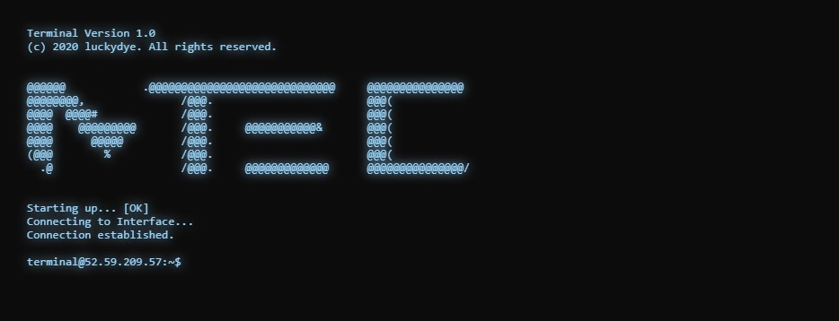

## Terminal
#### client-side functional and performant terminal component.

### Todo:
- Also output images as line(s) output ## just do howl html elements, overlay html elements onto the terminal buffer with pos absolute.
  - Mark the howl line with a prefix and use a json(string) as dataholder instead of utf characters
- *Fake* filesystem module. To browse *hidden* projects etc.
